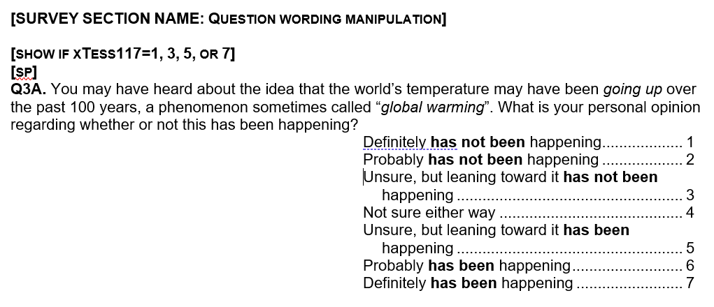
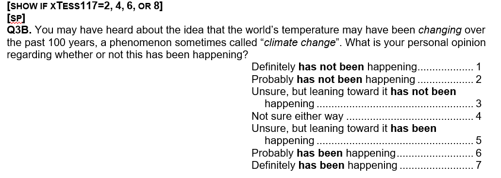

***
```{r setup, include = FALSE}

knitr::opts_chunk$set(fig.align = "center", eval=TRUE, tidy.opts=list(width.cutoff=60), tidy=TRUE, cache=TRUE)
paquetes <- c('ivreg')
suppressPackageStartupMessages(sapply(paquetes,require,character.only=TRUE))

```

# “Global Warming" or "Climate Change"? Whether the Plante is Warming Depends on Question Wording

Tomando los datos de replicación de: Schuldt, Konrath & Schwarz. (2011). “Global Warming" or "Climate Change"? Whether the Plante is Warming Depends on Question Wording. The Public Opinion Quarterly, 75(1), 115–124. 

http://www.jstor.org/stable/41288371

## Asignación al tratamiento

{fig-align="center"}

## Preguntas - manipulación del enunciado

{fig-align="center"}

{fig-align="center"}


# Análisis

```{r, tidy=TRUE, messages=FALSE, warnings=FALSE}
# Cargar datos
schuldt <- rio::import("https://drive.google.com/uc?id=10h1NZ8rtOvXg7RwM0yUKtUpgsQeMJ5LI&export=download")
names(schuldt)
dim(schuldt)
```

```{r, tidy=TRUE, messages=FALSE, warnings=FALSE}
# Condiciones experimentales
table(schuldt[["XTESS117"]])
# 1,3,5,7 = "Global Warming"
# 2,4,6,8 = "Climate Change"
schuldt[["gw"]] <- ifelse(schuldt[["XTESS117"]] %in% c(1,3,5,7), 1L, 0L)

# Medidas de resultado (1-7; mayores valores = gw happening)
table(schuldt[["Q3A"]], useNA = "always")
table(schuldt[["Q3B"]], useNA = "always")
```

```{r, tidy=TRUE, messages=FALSE, warnings=FALSE}
# Limpiando datos
schuldt[["Q3A"]] <- ifelse(is.nan(schuldt[["Q3A"]]), NA_real_, schuldt[["Q3A"]])
schuldt[["Q3B"]] <- ifelse(is.nan(schuldt[["Q3B"]]), NA_real_, schuldt[["Q3B"]])

# Generar variable resultado:
schuldt[["outcome"]] <- dplyr::coalesce(schuldt[["Q3A"]], schuldt[["Q3B"]])
schuldt[["outcome"]] <- ifelse(schuldt[["outcome"]] == -1, NA_real_, schuldt[["outcome"]])
table(schuldt[["outcome"]])
mean(schuldt[["outcome"]], na.rm = TRUE)
var(schuldt[["outcome"]], na.rm = TRUE)
sd(schuldt[["outcome"]], na.rm = TRUE)
```

## Diferencias entre grupos
```{r, tidy=TRUE, messages=FALSE, warnings=FALSE}
aggregate(outcome ~ gw, data = schuldt, mean, na.rm = TRUE)
t.test(outcome ~ gw, data = schuldt)
summary(lm(outcome ~ gw, data = schuldt))
t.test(outcome ~ gw, data = schuldt, var.equal = TRUE)
```

## Partidos
```{r, tidy=TRUE, messages=FALSE, warnings=FALSE}
# 1:3 = Republican
# 5:7 = Democrat
table(schuldt[["PARTY7"]], useNA = "always")
schuldt[["republican"]] <- ifelse(schuldt[["PARTY7"]] %in% 1:3, 1L, 
                                  ifelse(schuldt[["PARTY7"]] %in% 5:7, 0L, NA_real_))
table(schuldt[["PARTY7"]], schuldt[["republican"]], useNA = "always")

aggregate(outcome ~ gw + republican, data = schuldt, mean, na.rm = TRUE)
t.test(outcome ~ gw, data = schuldt[schuldt[["republican"]] == 1L,])
t.test(outcome ~ gw, data = schuldt[schuldt[["republican"]] == 0L,])
```

