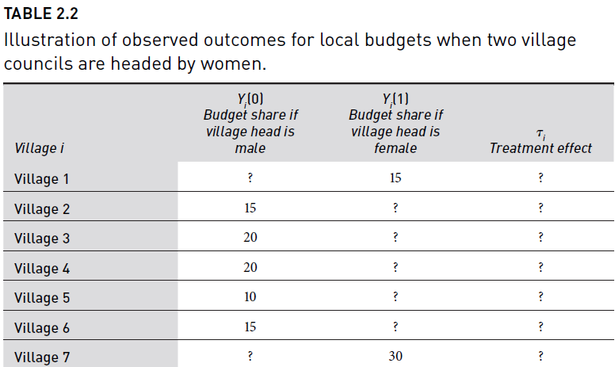

***
```{r setup, include = FALSE}

knitr::opts_chunk$set(fig.align = "center", eval=TRUE, tidy.opts=list(width.cutoff=60), tidy=TRUE, cache=TRUE)

paquetes <- c('readstata13', 'dplyr', 'data.table', 'ggplot2', 'tidyverse')
suppressPackageStartupMessages(sapply(paquetes,require,character.only=TRUE))

```


***

# Randomization Inference

La inferencia de aleatorización (RI) es un procedimiento para realizar pruebas de hipótesis en experimentos aleatorios. RI es útil para calcular la probabilidad de que:

- una estadística de prueba sería tan extrema o más como se observa...
- si una hipótesis nula particular fuera cierta...
- sobre todas las posibles aleatorizaciones que podrían haber ocurrido según el diseño .

A esa probabilidad a veces se le llama p-valor.


## Paquete `ri2`

Gerber y Green (2012) describen un experimento hipotético en el que a 2 de 7 aldeas se les asigna una jefa de consejo y el resultado es la parte del presupuesto local asignada al saneamiento del agua. Su tabla 2.2 describe una forma en que podría haber resultado el experimento.



```{r, tidy=TRUE}

table_2_2 <- data.frame(Z = c( 1,  0,  0,  0,  0,  0,  1),
                        Y = c(15, 15, 20, 20, 10, 15, 30))

table_2_2

```

Cargamos la librería:

```{r, tidy=TRUE}
# install.packages("ri2")
library(ri2)
```

Para realizar una inferencia de aleatorización debemos proporcionar 

1) una estadística de prueba
2) una hipótesis nula  
3) un procedimiento de aleatorización

**La estadística de prueba**. El argumento `formula` de la función `conduct_ri` tiene una sintaxis análoga a la función `lm` o a la expresión de `formula` en R. El estadístico de prueba es el coeficiente Z de una regresión de Y en Z, en concreto, la diferencia de medias.

**La hipótesis nula**. El argumento `sharp_hypothesis` de la función `conduct_ri` indica que estamos imaginando un mundo en el que la verdadera diferencia en los resultados potenciales es exactamente 0 para todas las unidades.

**El procedimiento de aleatorización**. La funcion `declare_rafunción` del paquete `randomizr` permite declarar un procedimiento de aleatorización. En este caso, estamos asignando 2 unidades a tratamiento sobre un total de unidades.


#### Paso a paso

Se declarar procedimiento de aleatorización

```{r, tidy=TRUE}

declaration <- randomizr::declare_ra(N = 7, m = 2)

declaration


N = 7
m = 2
(p_0 = (N-m) / N)
(p_1 = 1 - p_0)

```

Se realiza la inferencia..


```{r, tidy=TRUE}
ri2_out <- conduct_ri(
  formula = Y ~ Z,
  declaration = declaration,
  sharp_hypothesis = 0,
  data = table_2_2
)

ri2_out
```


Observamos el resumen

```{r, tidy=TRUE}
summary(ri2_out)
```

Visualizamos

```{r, tidy=TRUE}
plot(ri2_out)
```


## Procedimiento manual


```{r, tidy=TRUE}
# Datos del experimento
tratadas <- c(15, 30)                 # Datos de las unidades tratadas
no_tratadas <- c(15, 20, 20, 10, 15)  # Datos de las unidades no tratadas

# Estadística observada: Diferencia en medias
estadistica_obs <- mean(tratadas) - mean(no_tratadas)
estadistica_obs

# Combinar datos
datos_combinados <- c(tratadas, no_tratadas)

# Número de permutaciones
num_permutaciones <- 10000

# Vector para almacenar las estadísticas permutadas
estadisticas_permutadas <- numeric(num_permutaciones)

set.seed(42)  
for (i in 1:num_permutaciones) {
  datos_permutados <- sample(datos_combinados, replace = FALSE)
  estadisticas_permutadas[i] <- mean(datos_permutados[1:2]) - mean(datos_permutados[3:7])
}

# p-valor
valor_p <- mean(abs(estadisticas_permutadas) >= abs(estadistica_obs))

valor_p 

```


Visualizamos el resultado:

```{r, tidy=TRUE, warning=FALSE}

library(ggplot2)

ggplot(data.frame(estadisticas_permutadas), aes(x = estadisticas_permutadas)) +
  geom_histogram(binwidth = 1, fill = "#279F00", color = "black") +
  geom_vline(xintercept = estadistica_obs, color = "red", linetype = "dashed", size = 1) +
  labs(title = "Distribución Nula de la Estadística",
       x = "Diferencia en Medias",
       y = "Frecuencia") +
  theme_minimal()


```


## Ejercicio

Utilizando los siguientes [datos](https://raw.githubusercontent.com/egap/methods-guides/master/ri2/complete_dat.csv) declare un diseño de asignación aleatoria completo y realice la inferencia de aleatorización y visualice el resultado.


```{r, tidy=TRUE, warning=FALSE}

## por ejemplo puede cargar los datos de la siguiente manera

## rio::import(url)

```


