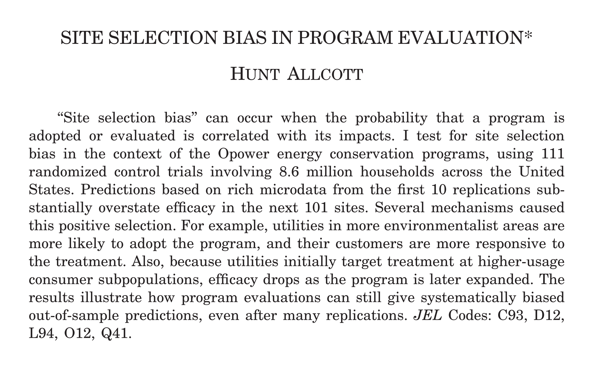
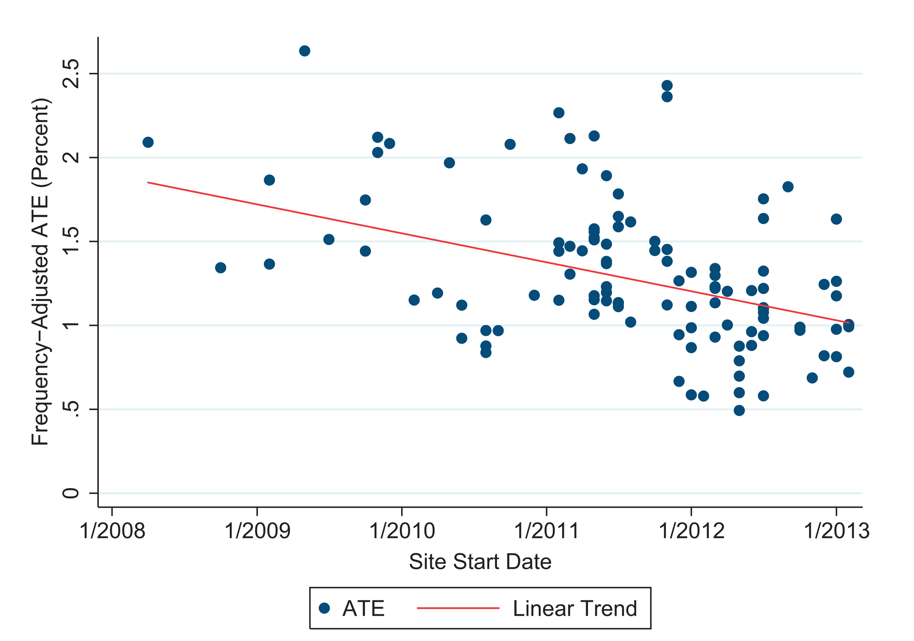
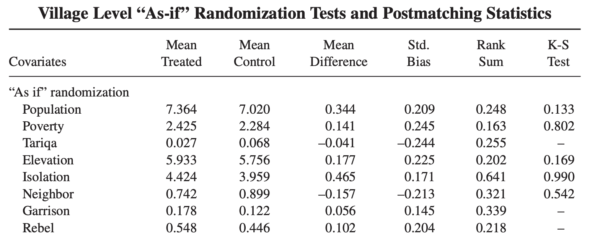

```{r setup, include=FALSE}
knitr::opts_chunk$set(echo = FALSE)
```


## Tema 1. Inferencia causal

- El modelo de causalidad Neyman–Rubin
- Experimentos aleatorizados y validez
- Asignación aleatoria simple
- Estimandos (ATE, ITT, CACE, SATE, PATE, ATT, CATE, mediación)


## Lecturas

- Gerber, Alan S., and Donald P. Green. 2012. *Field Experiments: Design, Analysis, and Interpretation.* New York: W.W. Norton. (FEDAI). capítulos 1-2. 

- Imbens, G. W., & Rubin, D. B. (2015). Causal inference in statistics, social, and biomedical sciences. Cambridge University Press. (CISSBS), capítulos 1-2.

- [10 Types of Treatment Effect You Should Know About](https://egap.org/resource/10-types-of-treatment-effect-you-should-know-about/)

- Aronow, P. M. and Samii, C. (2016). "Does regression produce representative estimates of causal effects?" *American Journal of Political Science*, 60(1):250–267

- Barabas, J. and Jerit, J. (2010). "Are survey experiments externally valid?" *American Political Science Review*, 104(2):226–242


# Causalidad


## Qué es la causalidad

“[...] *something that makes a difference, and the difference it makes must be a difference from what would have happened without it*.”\footnote{Lewis, David. Causation. *The journal of philosophy* (1973): 556-567}

## Qué es la causalidad

- "$X$ causó $Y$" ($Y$ está presente e $Y$ no habría estado presente si $X$ no hubiera estado presente). \pause

- El "efecto" de $X$ sobre $Y$ es la diferencia entre el valor que $Y$ habría tomado dado un valor de $X$ y el valor que $Y$ habría tomado dado otro valor de $X$ . \pause

- La diferencia de resultados surge de considerar un *contrafactual*. 


## Efecto causal (Imbens y Rubin)

El efecto de una intervención/programa/política en un indicador de interés (Y) es la **diferencia entre dos resultados potenciales** de un individuo/grupo (con/sin ''tratamiento''), pero no depende de cuál de dichos resultados es observado.


## Resultados potenciales

- $Y_i(1)$ resultado de la unidad $i$ que se observaría si recibiera un tratamiento ($T_i=1$).

- $Y_i(0)$ el resultado que se observaría en la unidad $i$ si no recibiera el tratamiento ($T_i=0$).


## Efecto causal (Imbens y Rubin)

$$\tau_i=Y_i(1)-Y_i(0)$$

- $\tau_i$ es efecto causal del tratamiento para la unidad $i$


## Resultados potenciales

\begin{table}[]
\begin{tabular}{cccc}
Unidad & Y(0) & Y(1) & Y(1) - Y(0) \\ \hline
1      & 3    & 4    & 1           \\
2      & 5    & 6    & 1           \\
3      & 4    & 3    & -1          \\
4      & 6    & 5    & -1          \\ 
6      & 7    & 7    & 0           \\ 

       &      &      &             \\ 

Media  & 5    & 5    & 0           \\ \hline
\end{tabular}
\end{table}

- Tenemos el efecto del tratamiento para cada individuo.

- Obsérvese la heterogeneidad en los efectos del tratamiento a nivel individual.

- Pero sólo tenemos como máximo un resultado potencial para cada individuo, lo que significa que no conocemos estos efectos del tratamiento.


## Características de esta definición de efecto causal

1. Es necesario definir la condición de control para definir un efecto causal.
    + Digamos que $T=1$ significa presupuesto participativo.  ¿Es $T=0$ la ausencia del PP?  ¿Es $T=0$ una reunión comunitaria sobre un tema diferente? ¿Es $T=0$ un folleto sobre el presupuesto local?
    + La frase "efecto causal de $T$ sobre $Y$" no tiene sentido si no se sabe qué significa no tener $T$.
1. Cada unidad individual $i$ tiene su propio efecto causal $\tau_i$.
1. Pero no podemos medir el efecto causal a nivel individual, porque no podemos observar $Y_i(1)$ y $Y_i(0)$ al mismo tiempo. Esto se conoce como el **problema fundamental de la inferencia causal**. Lo que observamos es $Y_i$:

\centering
$Y_i = T_iY_i(1) + (1-T_i)Y_i(0)$


## Problema fundamental de la inferencia causal
\pause
\begin{table}[]
\begin{tabular}{cccc}
Unidad & Y(0) & Y(1) & Y(1) - Y(0) \\ \hline
1      & 3    & ?    & ?           \\
2      & ?    & 6    & ?           \\
3      & ?    & 3    & ?           \\
4      & 6    & ?    & ?           \\ 
6      & ?    & 7    & ?           \\ 
       &      &      &             \\ 

Media  & 4.5  & 5.3  & 0.8           \\ \hline
\end{tabular}
\end{table}

\pause
$$Yi = d_i Y_i(1) + (1 - d_i) Y_i(0)$$


## Problema fundamental de la inferencia causal

{#id .class width=90%}


## Una solución...
\pause
\center
{#id .class width=100%}


# Identificación


## Efecto causal medio

 - Aunque no podemos medir el efecto causal individual, $\tau_i = Y_i(1)-Y_i(0)$, podemos asignar aleatoriamente sujetos a las condiciones de tratamiento y control para estimar el **efecto causal medio**, $\bar{\tau}_i$:


\centering
$\overline{\tau_i} = \frac{1}{N} \sum_{i=1}^N ( Y_i(1)-Y_i(0) ) = \overline{Y_i(1)-Y_i(0)}$

- El efecto causal medio también se conoce como efecto medio del tratamiento (ATE).


## Estimandos y preguntas causales

- Antes de hablar de la aleatorización y de cómo nos permite estimar la ATE, tener en cuenta que el ATE es un tipo de estimando.

- Un estimando es una cantidad sobre la que se quiere aprender (a partir de los datos). Es el objetivo de su investigación que *tu* eliges.

- Ser preciso sobre la pregunta de investigación significa ser preciso sobre el estimando. Para las preguntas causales, esto significa especificar:
   - El resultado
   - Las condiciones de tratamiento y control
   - La población de estudio


## Otros tipos de estimandos

- El ATE para un subgrupo concreto, también conocido como efecto medio condicional del tratamiento (CATE) 

- Las diferencias en los CATE: diferencias en el efecto medio del tratamiento para un grupo en comparación con otro grupo. 

- El ATE sólo para las unidades tratadas, también conocido como ATT (efecto medio del tratamiento sobre los tratados). 

- El ATE local (LATE).  "Local" = aquéllas cuyo estado de tratamiento cambiaría por un estímulo en un diseño de aliento (alias CACE, "*complier average causal effect*") o aquéllas en la vecindad de una discontinuidad para un diseño de regresión discontinua. 


## Estrategia de identificación

Una estrategia de identificación implica sortear el *problema fundamental de la inferencia causal*. 
Lo que \textcolor{red}{NO} podemos estimar:

$$
\begin{aligned}
E[Y_{i}(1) | T = 1] & - E[Y_{i}(0) | T = 0]
\end{aligned}
$$
\pause

\center 
{#id .class width=49%}


## Estrategia de identificación

- La idea central es estimar el contrafactual $Y_{i}(0)$ \pause
- Esto no puede hacerce para cada unidad que fue trtatada \pause
- Se puede usar un grupo de comparación y estimar una media $E[Y_{i} | T = 0]$

## Estrategia de identificación

Un grupo de comparación válido: 

(1) Tiene las mismas características, en promedio, que el grupo de tratamiento en ausencia del tratamiento; \pause
(2) no es afectado por el tratamiento; \pause
(3) reaccionaría al tratamiento de la misma manera que el grupo de tratamiento, si fuera objeto del tratamiento \pause

\center
{#id .class width=60%}


## Supuesto de independencia

La identificación descansa en el supuesto de independencia entre el **status de tratamiento** y los **resultados potenciales**

$$ Y_{i}(1), Y_{i}(0) \perp T_i $$

\pause

En ese caso, entonces:

$$
\begin{aligned}
ATE &=  E[Y_{i1} - Y_{i0}] \\
	&=  E[Y_{i1}] - E[Y_{i0}] \\
	&=  E[Y_{i} | T=1 ] - E[Y_{i} | T=0]
\end{aligned}
$$

La expectativa de resultados potenciales no-observados es igual la expectativa condicional en la asignación del tratamiento.  


## 	

¿Cuándo podemos justificar que el supuesto de independencia entre tratamiento y resultados potenciales se sostiene?

- Distintas ***estrategias de identificación***  

\vspace{16pt}


> "To ask what is your identification strategy is to ask what research design (and assumptions) one intends to use for the identification of a causal effect."
(Keele, 2015)


# Experimentos

## Experimentos aleatorizados

Estándar de oro de las estrategias de identificación

Los sujetos son asignados a $D_{i}$ en forma **aleatoria**

El investigador impone la independencia entre la **condición de tratamiento** y los **resultados potenciales** \pause

Tratados y no tratados son en expectativa iguales en:

- características observables 
- características no observables


## Diseños

Variedad de tipos de experimentos, por ej.:

- Experimentos de campo
	- Aleatorización de intervenciones (programas)
	- "Nudges" (o información) \pause
- Experimentos de laboratorio \pause
- Experimentos de encuesta
- Experimentos naturales

\pause

Número de condiciones de tratamiento:

- Tratamiento y Control
- Múltiples "brazos" ($T_1$, $T_2$, $C$) \pause
- Factoriales (2 x 2) \pause
- Otras estrategias de aleatorización 

\pause

Forma de asignación al tratamiento:

- Fuerza bruta\pause
- Aliento (promoción) 


## Nudges con tres brazos
{#id .class width=90%}
\begin{scriptsize}
Schultz et al. (2007) 
\end{scriptsize}

## Experimento de campo con diseño factorial

{#id .class width=90%}


## Fortalezas y limitaciones


Fortaleza:

- Validez interna


Limitaciones:

- Desgaste
- Efecto derrame
- Ética
- Validez externa


## Validez interna y externa


\begin{columns}
\begin{column}{0.4\textwidth}

\begin{scriptsize}
\textbf{Validez externa}: la \textit{muestra} de la evaluación representa con precisión a la población de unidades elegibles.

\vspace{16pt}


\textbf{Validez interna}: El impacto estimado del programa es el impacto libre de todos los demás factores de confusión potenciales (o, en otras palabras, que el grupo de comparación represente una estimación precisa del contrafactual de modo que se estime el verdadero impacto del programa).

\end{scriptsize}

\end{column}
\begin{column}{0.6\textwidth}


\includegraphics[width=1\textwidth]{figs/vive.png}

\begin{tiny}
Fuente: Gertler, et al. (2017).
\end{tiny}

\end{column}
\end{columns}


## Validez interna y externa

{#id .class with=90%}
\begin{tiny}
Fuente: Gertler, et al. (2017).
\end{tiny}

## Respuestas a la "crisis" de validez externa

- Investigar la existencia de efectos de tratamiento heterogéneos
	+ Interaccion entre $T_i$ y características de los sujetos $X_i$ (sexo, edad, educación, lugar de residencia, etc.)
	+ Depende de observables en $X$.
\pause
\vspace{16pt}

- Replicación


## Replicación

{#id .class width=90%}
[Ver proyectos Metaketa de EGAP aquí](https://egap.org/metaketa)


## Replicación

{#id .class width=90%}
\begin{tiny}
Allcott, H. (2015). Site Selection Bias in Program Evaluation. The Quarterly Journal of Economics, 130(3), 1117–1165. https://doi.org/10.1093/qje/qjv015
\end{tiny}


## Replicación y sesgos de selección

{#id .class width=90%}
\begin{tiny}
Allcott, H. (2015). Site Selection Bias in Program Evaluation. \textit{The Quarterly Journal of Economics}, 130(3), 1117–1165. https://doi.org/10.1093/qje/qjv015
\end{tiny}


## Experimentos Naturales

- Una situación real que produce una asignación casual a un tratamiento

- Esta situación genera una asignación al tratamiento ***como si fuera aleatoria*** (as-if random)

- Requiere una fuerte justificación


## 
{#id .class width=90%}

\begin{tiny}
Angrist, Joshua, Eric Bettinger, Erik Bloom, Elizabeth King, and Michael Kremer. 2002. “Vouchers for Private Schooling in Colombia: Evidence from a Randomized Natural Experiment.” \textit{American Economic Review} 92 (5): 1535–58.
\end{tiny}


## 
{#id .class width=90%}


## 
{#id .class width=90%}

## 
{#id .class width=90%}


# Aleatorización de la asignación al tratamiento


## Aleatorización de la asignación al tratamiento

- Aleatorización significa que cada observación tiene una probabilidad conocida de asignación a las condiciones experimentales *entre* 0 y 1.

- Ninguna unidad de la muestra experimental se asigna al tratamiento con certeza (probabilidad = 1) o al control con certeza (probabilidad = 0).

- Las unidades pueden variar en su probabilidad de asignación al tratamiento.

- Por ejemplo, la probabilidad puede variar según el grupo: las mujeres pueden tener una probabilidad del 25% de ser asignadas al tratamiento, mientras que los hombres tienen una probabilidad diferente.

- Incluso puede variar entre individuos, aunque esto complicaría el análisis.


## Asignación aleatoria frente a muestreo aleatorio

- Aleatorización (del tratamiento): asignación de sujetos con probabilidad conocida a las condiciones experimentales.

  + Esta asignación aleatoria del tratamiento puede combinarse con cualquier tipo de muestra (muestra aleatoria, muestra de conveniencia, etc.).

  + Pero el tamaño y otras características de la muestra afectarán a la potencia y a la capacidad de extrapolar los resultados a otras poblaciones.

- Muestreo aleatorio (de la población): selección de los sujetos de la muestra a partir de una población con una probabilidad conocida.


## Aleatorización

- Queremos la ATE, $\overline{\tau_i}= \overline{Y_i(1)-Y_i(0)}$.  

- Haremos uso del hecho de que la media de las diferencias es igual a la diferencia de las medias:

\centering
ATE $= \overline{Y_i(1)-Y_i(0)} = \overline{Y_i(1)}-\overline{Y_i(0)}$

## Aleatorización

- Asignamos *aleatoriamente* algunas de nuestras unidades a la condición de tratamiento. Para estas unidades tratadas, medimos el resultado $Y_i|T_i=1$, que es el mismo que $Y_i(1)$ para estas unidades.

- Como estas unidades se asignaron aleatoriamente al tratamiento, estos $Y_i=Y_i(1)$ para las unidades tratadas representan el $Y_i(1)$ para todas nuestras unidades.

- En expectativa (o en promedio a través de experimentos repetidos (escrito $E_R[]$)):

\centering
$E_R[\overline{Y_i}|T_i=1]=\overline{Y_i(1)}$.

- El $\overline{Y}|T_i=1$ es un estimador insesgado de la media poblacional de los resultados potenciales bajo tratamiento.  

- La misma lógica se aplica a las unidades asignadas aleatoriamente al control:  

\centering
$E_R[\overline{Y_i}|T_i=0]=\overline{Y_i(0)}$.

## Aleatorización

- Así que podemos escribir un estimador para el ATE:

\centering
  $\hat{\overline{\tau_i}} = ( \overline{Y_i(1)} | T_i = 1 ) - ( \overline{Y_i(0)} | T_i = 0 )$

- En la expectativa, o en promedio a través de experimentos repetidos, $\hat{\overline{\tau_i}}$ es igual al ATE:

\centering
  $E_R[Y_i| T_i = 1 ] - E_R[Y_i | T_i = 0] = \overline{Y_i(1)} - \overline{Y_i(0)}$.


- Podemos simplemente tomar la diferencia de estos estimadores insesgados de $\overline{Y_i(1)}$ y $\overline{Y_i(0)}$ para obtener una estimación insesgada del ATE.


## Tres supuestos clave

Para hacer afirmaciones causales con un experimento (o para juzgar si nos creemos las afirmaciones de un estudio), necesitamos tres supuestos fundamentales:

 - Asignación aleatoria de los sujetos al tratamiento, lo que implica que recibir el tratamiento es estadísticamente independiente de los resultados potenciales de los sujetos.

 - Suposición estabilidad del valor del tratamiento unitario  (SUTVA).

 - Excluibilidad, que significa que los resultados potenciales de un sujeto responden sólo al tratamiento definido, no a otros factores extraños que puedan estar correlacionados con el tratamiento.


## SUTVA, parte 1

1. El resultado potencial de un sujeto sólo refleja si recibe o no el tratamiento. No se ve afectado por cómo se asignan los tratamientos a otros sujetos.

   - Una violación clásica es el caso de las vacunas y sus efectos indirectos.

   - Supongamos una persona en la condición de control (sin vacuna).  Si su enfermedad ($Y_i(0)$) depende del estado de tratamiento de otras personas (si se vacunan o no), ¡es como si tuviera dos $Y_i(0)$ diferentes!

   - SUTVA (= stable unit treatment value assumption)

## SUTVA, parte 2

2. No hay variaciones ocultas del tratamiento

   - Digamos que el tratamiento es tomar una vacuna, pero hay dos tipos de vacunas y tienen ingredientes diferentes.

   - Un ejemplo de violación es cuando la posibilidad de estar  enfermo al recibir la vacuna ($Y_i(1)$) depende de la vacuna que haya tomado.  Tendríamos dos $Y_i(1)$ diferentes.


## Excluibilidad

- La asignación del tratamiento no tiene ningún efecto sobre los resultados, excepto a través de su efecto sobre si se recibió el tratamiento.

  - Es importante definir el tratamiento con precisión.
  
  - También es importante mantener la simetría entre los grupos de tratamiento y de control (por ejemplo, mediante el enmascaramiento, con los mismos procedimientos de recogida de datos para todos los sujetos del estudio, etc.), de modo que la asignación al tratamiento sólo afecte al tratamiento recibido, y no a otras cosas como las interacciones con los investigadores que no se quieran definir como parte del tratamiento.


## Aleatorización simple

- Para cada unidad, tiramos una moneda para ver si será tratada. Luego medimos la variable de resultado al mismo nivel que la moneda.

- Las monedas no tienen que ser justas (50-50), pero debemos conocer la probabilidad de asignación al tratamiento.

- No se puede garantizar un número concreto de unidades tratadas y unidades de control.

- Ejemplo: Si tiene 6 unidades y lanza una moneda justa para cada una, tiene aproximadamente un 3% de probabilidades de asignar **todas** las unidades al tratamiento o de asignar **todas** las unidades al control.


## Aleatorización completa

- Se asigna al tratamiento un número fijo $m$ de $N$ unidades. 

- La probabilidad de que una unidad se asigne al tratamiento es $m/N$.

- Es como tener una urna con $N$ bolas, de las que $m$ se marcan como tratamiento y $N-m$ como control. Las loterías públicas utilizan este método.


