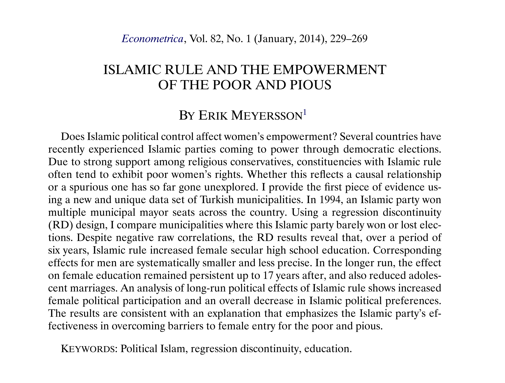

***

```{r setup, include = FALSE}
knitr::opts_chunk$set(fig.align = "center", eval=TRUE, tidy.opts=list(width.cutoff=60), tidy=TRUE, cache=TRUE)
# install.packages("ggplot2")
# install.packages("lpdensity")
# install.packages("rddensity")
# install.packages("rdrobust")
# install.packages("rdlocrand")
paquetes <- c('ggplot2', 'lpdensity','rddensity', 'rdrobust', 'rdlocrand')
suppressPackageStartupMessages(sapply(paquetes,require,character.only=T))
```


El taller está basado en el análisis sugerido por @Cattaneo2019. Aquí utilizamos los datos que reproducen los resultados de @Meyersson2014, *"Islamic Rule and the Empowerment of the Poor and Pious"*.




***

# Datos

El artículo de @Meyersson2014 analiza el efecto de la llegada del Partido Islámico al gobierno de municipalidades en Turquía sobre la escolarización de las mujeres en educación secundaria. 

```{r, tidy=TRUE}
data  <- read.dta13("/Users/slopezcariboni/Dropbox/Research/Teaching/Evaluacion de Impacto dECON/Impacto_grado/Talleres/RD/taller_3/CIT_2019_Cambridge_polecon.dta")
head(data)
mean(data$Y)
hist(data$Y)

Y = data$Y
X = data$X
T = data$T
T_X = T*X

```


***

# Diseño nítido

## Comparacion de medias

```{r}
rdplot(Y, X, nbins = c(2500, 500), p = 0, col.lines = "red", col.dots = "black", title = "", 
       x.label = "Islamic Margin of Victory", y.label = "Female High School Percentage", y.lim = c(0,70))

# Local comparison of means
out <- rdplot(Y[abs(X) <= 50], X[abs(X) <= 50], nbins = c(2500, 500), p = 4, col.lines = "red", col.dots = "black", title = "", 
       x.label = "Islamic Margin of Victory", y.label = "Female High School Percentage", y.lim = c(0,70))
out
```


# Gráficos RD

```{r}
plot(X, Y, xlab = "Score", ylab = "Outcome", col = 1, pch = 20)
abline(v=0)


## RD plot using 40 bins of equal length
out <- rdplot(Y, X, nbins = c(20,20), binselect = 'esmv', x.label = 'Score', y.label = 'Outcome', title = '',
       y.lim = c(0,25))
out
summary(out)
```

## 40 clases (bins) del mismo espacio

```{r}
out <- rdplot(Y, X, nbins = c(20,20), binselect = 'es', x.label = 'Score', y.label = 'Outcome', title = '',
       y.lim = c(0,25))
out
summary(out)
```

## 40 clases (bins) basadas en cuantiles
```{r}
out <- rdplot(Y, X, nbins = c(20,20), binselect = 'qs', x.label = 'Score', y.label = 'Outcome', title = '', 
       x.lim = c(-100,100), y.lim = c(0,25))
out
summary(out)
```


# Estimación


## Utilizando regresiones separadas para estimar cada intercepto

```{r}
out  <- lm(Y[X < 0 & X >= -20] ~ X[X < 0 & X >= -20])
left_intercept <- out$coefficients[1]
print(left_intercept)

out <- lm(Y[X >= 0 & X <= 20] ~ X[X >= 0 & X <= 20])
right_intercept <- out$coefficients[1]
print(right_intercept)

difference = right_intercept - left_intercept
print(paste("El estimador RD es", difference, sep = " "))
```


## Utilizando una regresión para estimar

```{r}

# Y = X + T + T_X

T_X = X * T
out = lm(Y[X >= -20 & X <= 20] ~ X[X >= -20 & X <= 20] + T[X >= -20 & X <= 20] + T_X[X >= -20 & X <= 20])
summary(out)
```


## Utilizando rdrobust

```{r}
out <- rdrobust(Y, X, kernel = "uniform", p = 1, h = 20)
summary(out)

# out <- rdrobust(Y, X, kernel = "triangular", p = 1, h = 20)
# summary(out)
```

## Utilizando la ventana optima (minizando MSE - mean squared error)

```{r}
bandwidth  <-  rdrobust(Y, X, kernel = 'triangular', p = 1, bwselect = 'mserd')$bws[1,1]
bandwidth

out  <-  rdplot(Y[abs(X) <= bandwidth], X[abs(X) <= bandwidth], p = 1, kernel = 'triangular')
summary(out)

out  <-  rdrobust(Y, X, kernel = 'triangular', scaleregul = 0,  p = 1, bwselect = 'mserd')
summary(out)
```


# Tests y falsificación

## Gráficos RD para variables predeterminadas

```{r}
rdplot(data$lpop1994, X,
       x.label = "Score", y.label = "", title = "Población")

rdplot(data$partycount, X,
       x.label = "Score", y.label = "", title = "Número de partidos")

rdplot(data$vshr_islam1994, X,
       x.label = "Score", y.label = "", title = "voto Islamico en 1994")

rdplot(data$i89, X,
       x.label = "Score", y.label = "", title = "Gobernador Islamico en 1989", x.lim = c(-100,100))

rdplot(data$merkezp, X,
       x.label = "Score", y.label = "", title = "Centro de provincia")

rdplot(data$merkezi, X,
       x.label = "Score", y.label = "", title = "Centro de distrito")
```


## Estimación de la densidad del SCORE en torno al punto de corte

### Histograma
```{r}
bw_left = as.numeric(rddensity(X)$h[1]); bw_right = as.numeric(rddensity(X)$h[2]);
tempdata = as.data.frame(X); colnames(tempdata) = c("v1");
plot2 = ggplot(data=tempdata, aes(tempdata$v1)) + theme_bw(base_size = 17) +
  geom_histogram(data = tempdata, aes(x = v1, y= ..count..), breaks = seq(-bw_left, 0, 1), fill = "blue", col = "black", alpha = 1) +
  geom_histogram(data = tempdata, aes(x = v1, y= ..count..), breaks = seq(0, bw_right, 1), fill = "red", col = "black", alpha = 1) +
  labs(x = "Score", y = "Number of Observations") + geom_vline(xintercept = 0, color = "black")
plot2
```

### Densidad estimada
```{r}
est1 = lpdensity(data = X[X < 0 & X >= -bw_left], grid = seq(-bw_left, 0, 0.1), bwselect = "IMSE",
                 scale = sum(X < 0 & X >= -bw_left) / length(X))
est2 = lpdensity(data = X[X >= 0 & X <= bw_right], grid = seq(0, bw_right, 0.1), bwselect = "IMSE",
                 scale = sum(X >= 0 & X <= bw_right) / length(X))
plot1 = lpdensity.plot(est1, est2, CIshade = 0.2, lcol = c(4, 2), CIcol = c(4, 2), legendGroups = c("Control", "Treatment"))+
  labs(x = "Score", y = "Density") + geom_vline(xintercept = 0, color = "black") +
  theme_bw(base_size = 17)+theme(legend.position = c(0.8, 0.85))
plot1
```


# Referencias