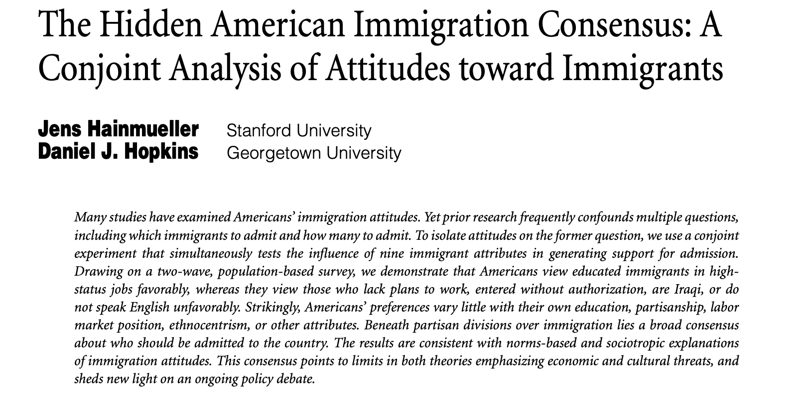

***

```{r setup, include = FALSE}
knitr::opts_chunk$set(fig.align = "center", eval=TRUE, tidy.opts=list(width.cutoff=60), tidy=TRUE, cache=TRUE)
paquetes <- c('ggplot2', "cregg")
suppressPackageStartupMessages(sapply(paquetes,require,character.only=T))
```


El taller está basado en el análisis del experimento sobre preferencias por política inmigratoria implementado por @Hainmueller2015a. 




***

# Datos

```{r, tidy=TRUE}

library("cregg") ## Este paquete contiene distintas bases de datos de experimentos conjoint
data("immigration")

```


***

# Descriptivos

```{r, tidy=TRUE}

head(immigration)


dim(immigration)


length(unique(immigration$CaseID)) # numero de respondentes

table(immigration$contest_no) # respuestas por TASK


```


## Descripción de medias marginales

```{r, tidy=TRUE}

f1 <- ChosenImmigrant ~ Gender + LanguageSkills + PriorEntry + Education * Job + CountryOfOrigin * ReasonForApplication + 
    JobExperience + JobPlans
plot(mm(immigration, f1, id = ~CaseID), vline = 0.5)

```


# Análisis

## Average Marginal Component Effects (AMCE)


```{r, tidy=TRUE}

# estimation
amces <- cj(immigration, f1, id = ~CaseID)
head(amces[c("feature", "level", "estimate", "std.error")], 20)

```

## Graficar AMCEs

```{r, tidy=TRUE}

# plotting of AMCEs
plot(amces)


```


# Referencias