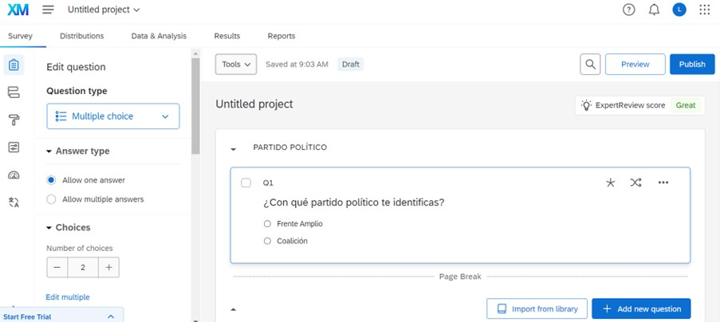

```{r setup, include=FALSE}
knitr::opts_chunk$set(echo = FALSE)
```


## Qualtrics

Herramienta versátil y de manejo sencillo que permite elaborar cuestionarios online, para ser utilizados en estudios de encuesta y experimentos

## Crear cuenta

1. Ingresar a: https://www.qualtrics.com/free-account/?utm_lp=login-banner

2. Crear una cuenta

## Importar experimento

3. Ingresar al usuario

4. Ir a "Projects"

5. Create project

6. Seleccionar "Survey" - Get start

7. Completar "Name" y "Folder"

8. Donde dice "How do you want to start your survey?" seleccionar "Import a QSF file"

9. Chose file: "Experimentos_de_encuesta.qsf"

10. Seleccionar "Create project"

## Encuesta - Inicio

{fig-align="center"}

## Encuesta - Survey Flow

{fig-align="center"}

## Qualtrics

- Randomizer: https://www.qualtrics.com/support/survey-platform/survey-module/survey-flow/standard-elements/randomizer/

- Embedded data: https://www.qualtrics.com/support/survey-platform/survey-module/survey-flow/standard-elements/embedded-data/

- Branch logic: https://www.qualtrics.com/support/survey-platform/survey-module/survey-flow/standard-elements/branch-logic/

- Question randomization: https://www.qualtrics.com/support/survey-platform/survey-module/block-options/question-randomization/

- Display logic: https://www.qualtrics.com/support/survey-platform/survey-module/question-options/display-logic/

## Ejercicio 1 - Diseño del Experimento

1. Realizar un sorteo en el survey flow para dividir a quienes realizan la encuesta en dos grupos (T1 y T2). (Randomizer y Embedded Data) 

2. Asignar un tratamiento a la mitad de los encuestados (Block 1) y el otro tratamiento a los restantes (Block 2). (Branch logic)

3. Dentro del bloque 1 y bloque 2, indicar que aparezca la pregunta que corresponde según lo que respondieron en Q1. (Display logic)

3. Aleatorizar el orden en que aparecen las opciones de respuestas en las preguntas Q1 y Q10 (Question randomization)

4. Manipulation check: Condicionar para que aparezca la opción contraria a lo que respondieron en la pregunta 1 (Display Logic)

## Ejercicio 2 - Grupo control y/o placebo

1. Grupo Control: Incorporar un nuevo grupo en el sorteo que no reciba ningun tratamiento

2. Placebo: 
    a. generar una nueva pregunta "Placebo"
    b. incorporar un nuevo grupo en el sorteo y asignar a ese grupo para que reciba el placebo 


