```{r setup, include=FALSE}
knitr::opts_chunk$set(echo = FALSE)
```


## Tema 6. Tipos de experimentos en ciencias sociales

1. Experimentos de Campo
2. Experimentos Naturales
3. Experimentos de Encuesta
4. Experimentos de Laboratorio


# Experimentos de Campo

## Lecturas

- Gerber, Alan S, and Donald P Green. 2012. Field Experiments: Design, Analysis, and Interpretation. WW Norton.

- List, J. A. (2011). “Why economists should conduct field experiments and 14 tips for pulling one off”. The Journal of Economic Perspectives, 25(3):3–15


## ¿Qué son los experimentos de campo?

- Estudios aleatorizados que se llevan a cabo en entornos reales
- Campo: evoca a los primeros experimentos agrícolas que se realizaban en los campos
- Varios criterios a tener en cuenta:
    - El **tratamiento** utilizado en el estudio se parece a la *intervención de interés* en el mundo
    - Los **participantes** se parencen a los *actores que normalmente se encuentran con estas intervenciones*
    - El **contexto** en el que los sujetos perciben el tratamiento se parece al *contexto de interes*
    - Las medidas de los **resultados** se parecen a los *resultados reales de interés* teórico y práctico
    
## ¿Qué son los experimentos de campo?

- Experimentos que intentan ser lo más realistas y discretos posibles para probar hipótesis más específicas del contexto

- Estudios experimentales con poco contenido de campo: 
    - realizan intervenciones reales en entornos artificiales a sujetos que son conscientes que forman parte de un estudio


## Algunas ventajas de los experimentos de campo

- Resuelve algunas amenzas a la inferencia cuando se extraen generalizaciones a partir de resultados obtenidos en entornos de laboratorio
- Se diseñan para que las generalizaciones dependan menos de las suposiciones
- La intervención suele ser discreta:
    - la intervención y la medición de los resultados no alerta a los sujetos del hecho de que están siendo estudiados
- Tienden a controlar el comportamiento durante largos períodos de tiempo
    - Fuertes efectos instantaneos que decaen con el tiempo
    
## Algunas limitantes de los experimentos de campo
- Si los sujetos saben que están siendo estudiados o si perciben que el tratamiento que han recibido debe provocar un determinado tipo de respuesta, es posible que expresen las opiniones o informen del comportamiento que creen que el experimentador quiere oír 
- No se pueden administrar tan fácilmente múltiples variaciones de un tratamiento para probar proposiciones teóricas precisas
- A menudo resulta difícil ponerlos en práctica:
    - los investigadores no toman decisiones unilaterales
    - coordinación entre investigadores y quienes proporcionan datos o llevan adelante la intervención

## Evaluaciones de programas

Muchos experimentos de campo adoptan la forma de "evaluaciones de programas" diseñadas para calibrar hasta qué punto los recursos se despliegan con eficacia.

Ejemplo: para comprobar si la campaña de publicidad televisiva de una candidata política aumenta su popularidad, un experimento de campo podría aleatorizar las zonas geográficas en las que se despliegan los anuncios y medir las diferencias de apoyo de los votantes.

## Ejemplo^[Borraz, F., Caro, A., Caño-Guiral, M. et al (2022) "A randomised evaluation of a financial literacy programme for upper secondary school students in Uruguay." Int Rev Educ 68, 885–896.]

A randomised evaluation of a financial literacy programme for upper secondary school students in Uruguay. 

{width=70%}


## Nudge^[Bloomfield, J., A. Balsa, A. Cid. (2022). "Using Behavioral Insights in Early Childhood Interventions: the Effects of Crianza Positiva E-Messaging Program on Parental Investment." Review of Economics of the Household.  1-36.]

{width=80%}


## Nudge^[https://www.socialscienceregistry.org/trials/6321]

{fig-align="center"}

## Generalización y validez externa

- La aleatorización aporta un alto grado de validez interna al estudio 
- Pero los resultados obtenidos en un lugar y momento particular pueden no ser válidos en otros contextos (validez externa)
- Este es un problema general, no solo de los experimentos

Una opción de solución:

La iniciativa Metaketa de EGAP: tomar una pregunta amplia, que tenga relevancia de política para los gobiernos, identificando la intervención que es pretendida e implementar un grupo de estudios coordinados que puedan proveer respuestas confiables a la pregunta.

## Consideraciones éticas

- La investigación en ciencias sociales usualmente involucra a sujetos humanos, de quienes recogemos datos.
- Por su naturaleza, la investigación experimental es intervencionista. Los experimentos de campo buscan generar impactos de la vida real en la sociedad, los procesos políticos y los resultados económicos.
- Esto conlleva a responsabilidades éticas como investigadores.

## Consideraciones éticas

- Tener cuidado con los beneficios potenciales del conocimiento que se obtendrá frente a los riesgos potenciales de daño a las personas y comunidades donde realizamos la investigación.
- Esto no es tan fácil:
    - El que un resultado sea bueno o malo puede depender de la perspectiva de cada uno, lo que a veces dificulta el equilibrio entre riesgos y beneficios.
    - Somos propensos a sobrestimar significativamente los beneficios del conocimiento, por lo que debemos ser cautelosos y tener controles externos.

# Experimentos Naturales

## Lecturas

- Dunning, Thad. 2012. Natural Experiments in the Social Sciences Natural Experiments in the Social Sciences. 

- Dunning, Thad. 2008. “Improving Causal Inference: Strengths and Limitations of Natural Experiments.” Political Research Quarterly 61(2): 282–293.

## ¿Qué son los Experimentos Naturales?

- Los datos usados en experimentos naturales surgen de fenómenos ocurridos en la "naturaleza"
    - Fenómenos relacionados a procesos sociales y políticos
- Como la asignación al tratamiento no es manipulada por el investigador, son estudios observacionales
    - Crean situaciones que se aproximan a los verdaderos experimentos
- Sin embargo, el investigador puede afirmar de forma creíble que la asignación es "como si" fuera aleatoria (as if random)

## El primer experimento natural estudiado (Snow)

\begin{columns}
\begin{column}{0.8\textwidth}
\begin{itemize}
\item En el siglo XIX Londres sufrió de una epidemia de cólera
\begin{itemize}
\item Había diversas teorías para explicar la transmisión
\item Snow sugería que la enfermedad se transmitía a través del agua
\end{itemize}
\item Londres era abastecido por dos grandes compañías de agua
\item Una de ellas trasladó su tubería de captación río arriba en el Támesis: "obtuvo un suministro de agua bastante libre de las aguas residuales de Londres"
\item Esto proporcionó un experimento natural
\item Las casas abastecidas por la empresa con el nuevo suministro, vieron reducidas las tasas de mortalidad por cólera
\end{itemize}
\end{column}
\begin{column}{0.2\textwidth}
\includegraphics[width=\textwidth]{figs/john_snow.png}
\end{column}
\end{columns}


## ¿Por qué el trabajo de Snow es creíble como experimento natural?

\begin{columns}
\begin{column}{0.6\textwidth}
\begin{itemize}
\item La asignación a las condiciones de tratamiento y control fue "as if random"
\item La provisión de agua es independiente de factores observables e inobservables que podrían influenciar las tasas de muerte por cólera
\item La gente no se movió en respuesta del tratamiento
\item Grupos de tratamiento y control eran balanceados en relación a otras variables medibles que podrían explicar las tasas de muerte por cólera
\end{itemize}
\end{column}
\begin{column}{0.4\textwidth}
\includegraphics[width=\textwidth]{figs/map_snow.png}
\end{column}
\end{columns}


## ¿Por qué usar Experimentos Naturales?    

- Hay contextos donde realizar experimentos directos es caro, tiene problemas éticos, o impráctico
- Muchas de las causas que más importan a los investigadores no son manipulables
- En estos casos los experimentos naturales proporcionan una herramienta valiosa
    
## Descubriendo Experimentos Naturales

- \textit{Standard}
    - Utilizar un dispositivo aleatorio real con una distribución de probabilidades conocida que asigna a los sujetos a la condición de tratamiento y control (ej. lotería)
    - Aprovechar la existencia de fronteras políticas o jurisdiccionales que separen poblaciones similares de individuos, comunidades, empresas u otras unidades de análisis
    - Fenómenos naturales como clima

- Diseño en Regresión Discontinua (RDD)
    - Reglas institucionales que crean umbrales estrictos que asignan sujetos a control y tratamiento 
    - Es clave que los individuos no se auto-seleccionen en tratamiento
    
- Diseños de Variables Instrumentales
    
## Experimentos Naturales \textit{Standard} comunes

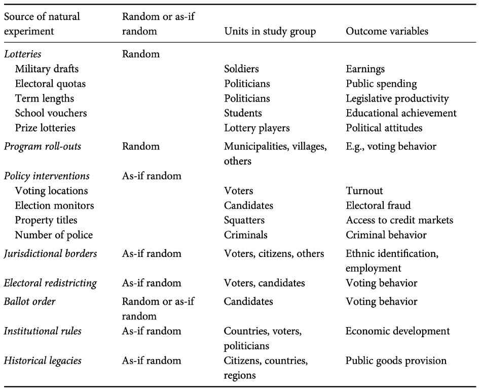{fig-align="center"}

## Experimentos Naturales \textit{Standard} con as-if randomization

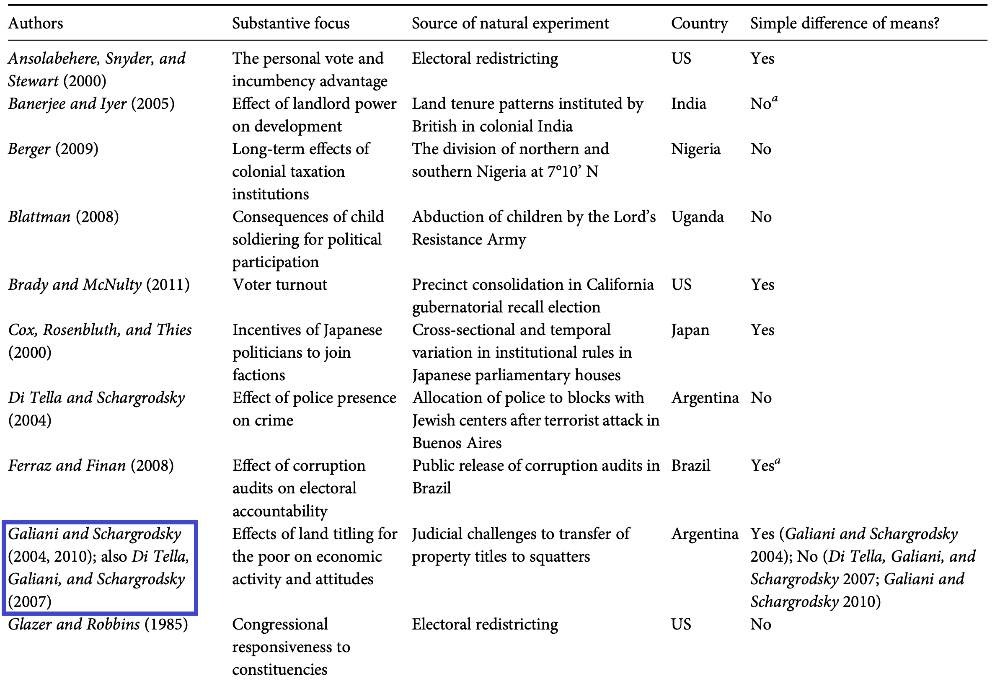{fig-align="center"}

## Experimentos Naturales \textit{Standard} con as-if randomization

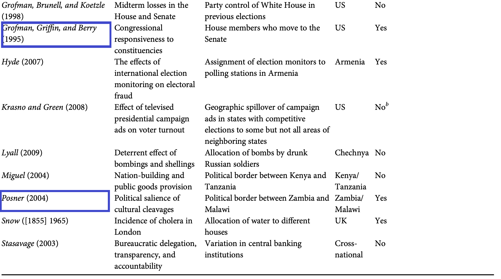{fig-align="center"}

## Diseños en Regresión Discontinua: fuentes seleccionadas

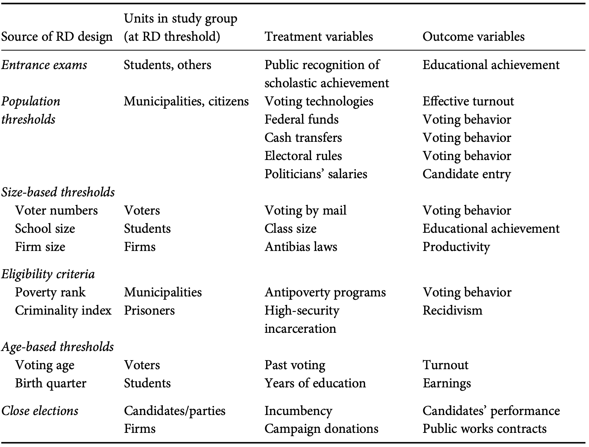{fig-align="center"}

## Diseños en Regresión Discontinua: Ejemplos

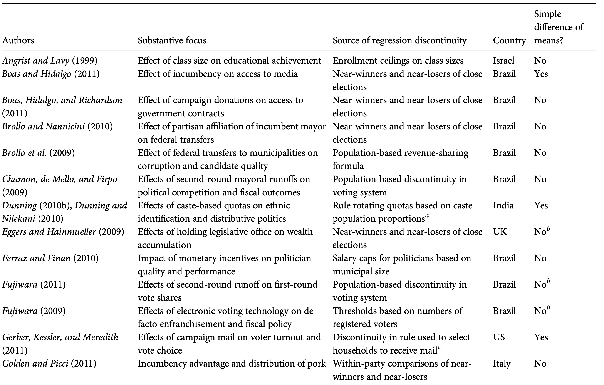{fig-align="center"}

## Diseños en Regresión Discontinua: Ejemplos

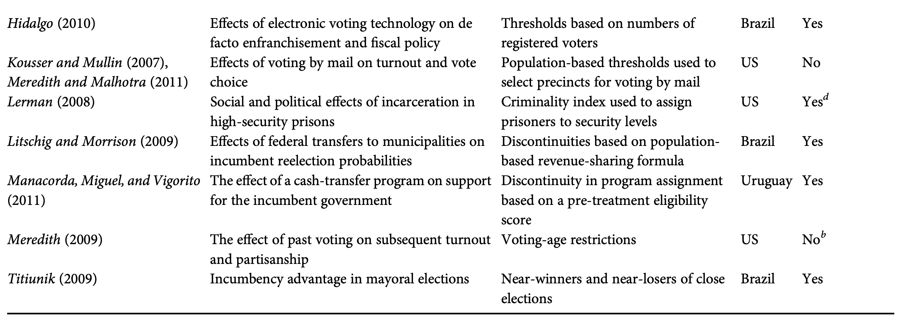{fig-align="center"}

## Diseños de Variables Instrumentales: fuente de la VI

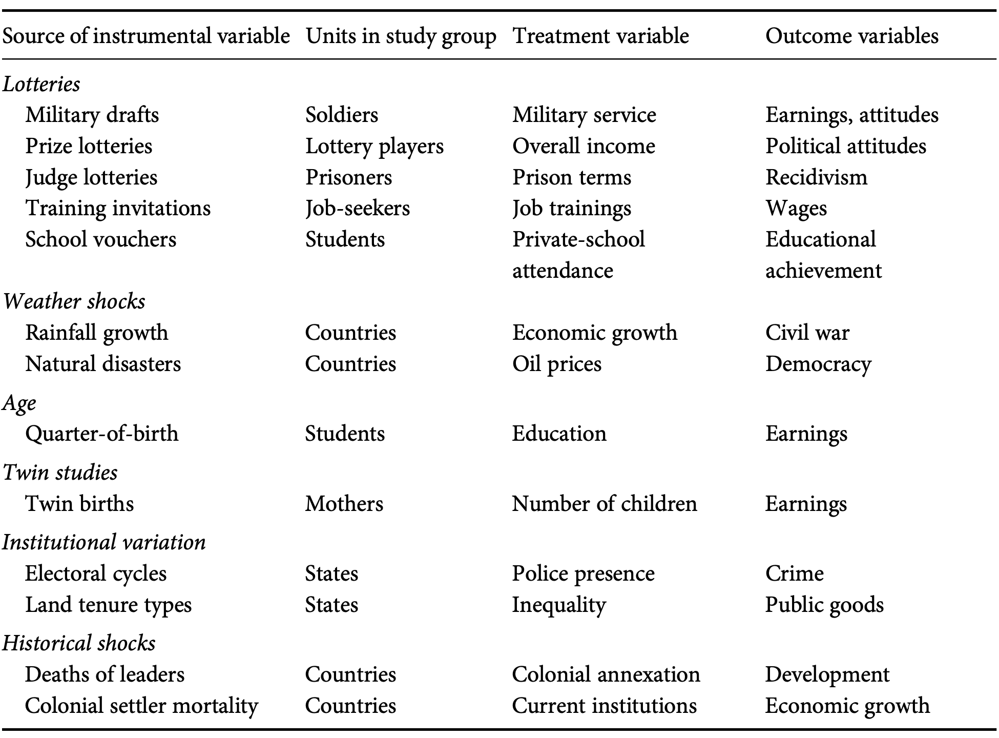{fig-align="center"}

## Diseños de Variables Instrumentales: Ejemplos

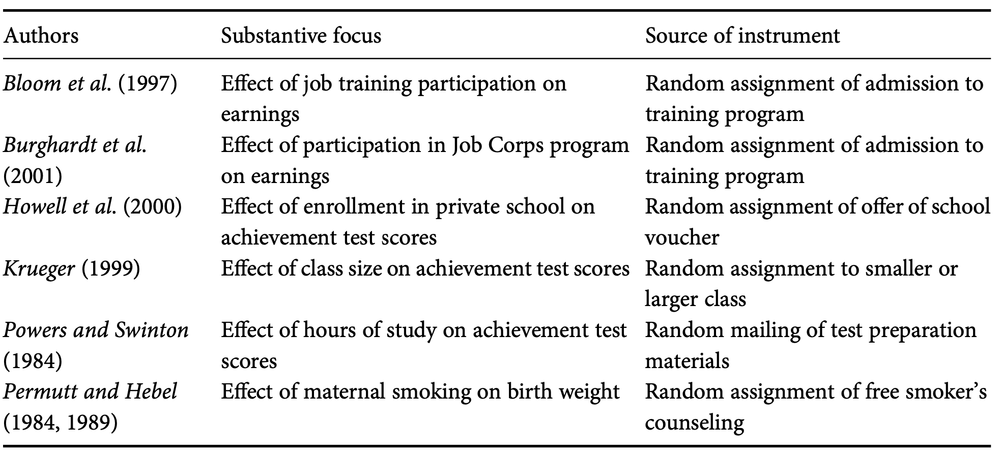{fig-align="center"}

## Evaluando Experimentos Naturales: limitaciones

- Su uso conlleva retos analíticos específicos

- Evaluando el "as-if random":
    - Tests de balance
    - Diagnósticos cualitativos

- Dado que no se planificados sino descubiertos, el uso de experimentos naturales para un determinado programa de investigación implica un elemento de suerte

## Plausibility of as-if random assignment

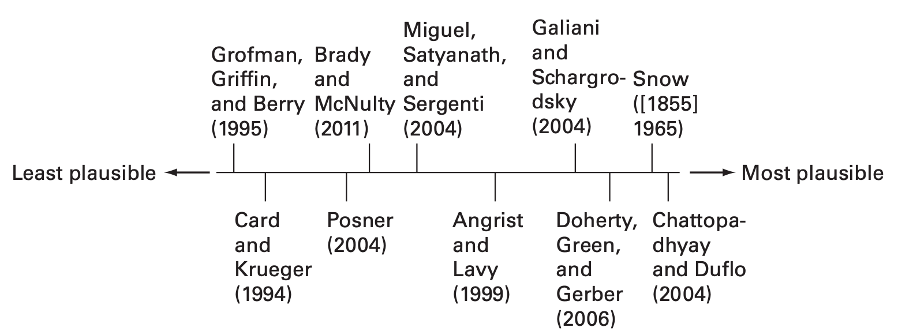{fig-align="center"}

## Relevancia de la intervención

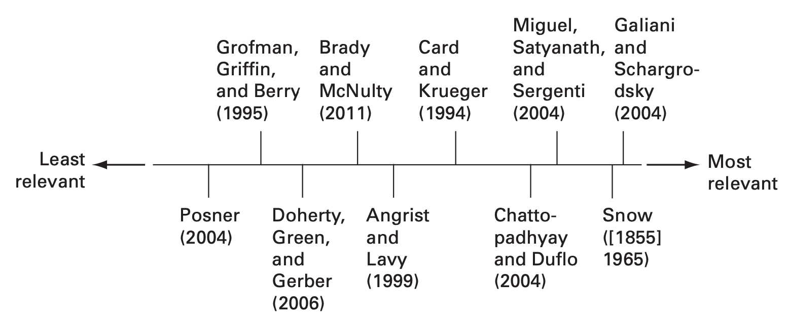{fig-align="center"}

## Fortaleza de los diseños

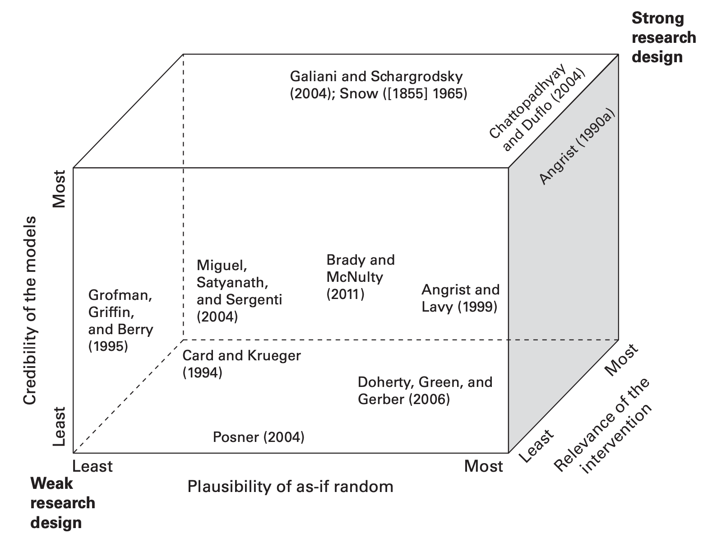{fig-align="center"}

# Experimentos de Encuesta

## Lecturas

- Gaines, Brian J., James H. Kuklinski, and Paul J. Quirk. 2007. "The Logic of the Survey Experiment Reexamined." Political Analysis 15(01): 1–20. 

- Coppock, Alexander. 2018. "Generalizing from Survey Experiments Conducted on Mechanical Turk: A Replication Approach." Political Science Research and Methods (2015): 1–16.

- Tobergte, David R., and Shirley Curtis. 2013. "The Generalizability of Survey Experiments." Journal of Chemical Information and Modeling 53(9): 1689–99.

## Actividad 

1. Tomen un papel
2. No digan el número que les tocó
3. Grupo 2, cierren los ojos


## Actividad

Grupo 1

Piensen si la población de Chicago es mayor o menor a 500.000 habitantes.

¿Cuál crees que es la población de Chicago?

## Actividad

Grupo 1, cierren los ojos

## Actividad

Grupo 2

Piensen si la población de Chicago es mayor o menor a 10.000.000 habitantes.

¿Cuál crees que es la población de Chicago?

## Ingresar los datos

Vayan a: https://bit.ly/2Sxsp17

Ingresen creencia y su número de grupo

## Resultados

- Población verdadera: 2.79 millones

- Ver resultados

## El primer experimento de encuesta

Hadley Cantril (1940) le preguntó a 3000 Americanos 

Piensas que U.S. debería hacer más de lo que está haciendo actualmente para ayudar 
a Inglaterra y Francia?

+ Si
+ No 

## El primer experimento de encuesta

Hadley Cantril (1940) le preguntó a 3000 Americanos 

Piensas que U.S. debería hacer más de lo que está haciendo actualmente para ayudar 
a Inglaterra y Francia?

+ Si
+ No 

Piensas que U.S. debería hacer más de lo que está haciendo actualmente para ayudar 
a Inglaterra y Francia **en su pelea contra Hitler**?

+ Si
+ No

## El primer experimento de encuesta

Hadley Cantril (1940) le preguntó a 3000 Americanos 

Piensas que U.S. debería hacer más de lo que está haciendo actualmente para ayudar 
a Inglaterra y Francia?

+ Si 13%
+ No 

Piensas que U.S. debería hacer más de lo que está haciendo actualmente para ayudar 
a Inglaterra y Francia **en su pelea contra Hitler**?

+ Si 22%
+ No

El “efecto Hitler” fue 22% - 13% = 9%

## ¿Qué son los Experimentos de Encuesta?

- Experimento realizado dentro de una encuesta

- Dos tipos de experimentos de encuesta:
    - Para medir actitudes o comportamientos sensibles
	- Para aprender sobre relaciones causales.

## Experimentos de encuesta para medir temas sensibles

- Temas sensibles: cualquier actitud o comportamiento con el que el encuestado no quiere que se le asocie públicamente
- Intentan proporcionar anonimato a los encuestados para que puedan expresar actitudes potencialmente delicadas sin ser identificados 

##  Experimentos de Lista

- Se asigna aleatoriamente a los encuestados a una condición de control o de tratamiento:
    - Control: presenta a los encuestados una lista de elementos
    - Tratamiento: presenta la misma lista más un elemento de tratamiento que mide la actitud o el comportamiento de interés.
- Se pregunta a los encuestados cuántos de esos ítems se aplican a su caso.

## Ejemplo: Experimentos de Lista

Kuklinski et al. (1997) estudiaron la discriminación racial con un experimento de listas de encuestas. 

Ahora voy a leerle cosas que a veces enfadan o molestan a la gente. Después de que las lea, dígame **CUÁNTAS** de ellas le molestan. No quiero saber cuáles, sólo **CUÁNTAS**.

1. Que el gobierno federal aumente el impuesto sobre la gasolina
2. Los contratos millonarios de los deportistas profesionales
3. Grandes empresas que contaminan el medio ambiente

## Ejemplo: Experimentos de Lista

Kuklinski et al. (1997) estudiaron la discriminación racial con un experimento de listas de encuestas. 

Ahora voy a leerle cosas que a veces enfadan o molestan a la gente. Después de que las lea, dígame **CUÁNTAS** de ellas le molestan. No quiero saber cuáles, sólo **CUÁNTAS**.

1. Que el gobierno federal aumente el impuesto sobre la gasolina
2. Los contratos millonarios de los deportistas profesionales
3. Grandes empresas que contaminan el medio ambiente
4. **Una familia negra que se muda a la casa de al lado**

## Ejemplo: Experimentos de Lista

- La media de ítems elegidos en el grupo de tratamiento fue de 2,37
- La media de ítems elegidos en el grupo de control fue de 1,95 
- La diferencia de 0,42 entre el grupo de tratamiento y el de control indica que al 42 porciento de los encuestados les molestaría que una familia negra se mudara a la casa de al lado. 

## Experimentos de Respuesta aleatoria

- También se utiliza para medir una actitud o comportamiento sensible 
- Utiliza un dispositivo de aleatorización para dictar si el encuestado debe responder a la pregunta delicada o a otra cosa 

## Ejemplo Experimentos de Respuesta aleatoria^[Blair, Imai y Zhou (2015) "Design and Analysis of the Randomized Response Technique." JASA 110(511): 1304–19.]

Aquí hay una bolsa; en ella hay piedras del juego 'Go', algunas de color negro y otras blancas. Por favor, saca una piedra y mira de qué color es, blanca o negra. No me digas si es negra o blanca, pero asegúrate de saber cuál es.

Si coge una **negra**, responda a la pregunta: "¿Ha tenido alguna vez un aborto inducido?"

Si coge una **blanca**, responda a la pregunta: "¿Nació usted en el año lunar del caballo?"

Consideraciones:

- Puede utilizar cualquier dispositivo de aleatorización
- Puede ser cognitivamente complejo

## Experimentos de encuesta para medir relaciones causales

Los experimentos de encuestas para medir relaciones causales son como cualquier otro experimento, salvo que la intervención experimental y la medición de resultados se producen en el contexto de una encuesta.

## Diseños de viñeta

- Una viñeta es un texto corto que describe una situación
- Se proporciona un escenario para que el encuestado lo lea, variando los componentes clave del escenario.

## Un ejemplo de viñeta^[Gilens, M. 1996. ```Race coding' andwhite opposition to welfare. American Political Science Review 90(3): 593--604.]

Ahora piensa en una mujer **(negra/blanca)** de treinta y pocos años. **(Finalizó/Abandonó)** sus estudios de bachillerato, tiene un hijo de diez años y lleva un año recibiendo ayudas sociales.

- ¿Qué probabilidad crees que hay de que tenga más hijos para recibir más ayudas sociales? (1 = Muy probable, ..., 7 = Nada probable)
- ¿Qué probabilidad crees que hay de que se esfuerce de verdad por encontrar trabajo el año que viene? (1 = Muy probable, ..., 7 = Nada probable)


## Tratamientos no textuales^[Iyengar et al. 2010. ``Do Explicit Racial Cues Influence Candidate Preference? The Case of Skin Complexion in the 2008 Campaign.'' Working paper.]

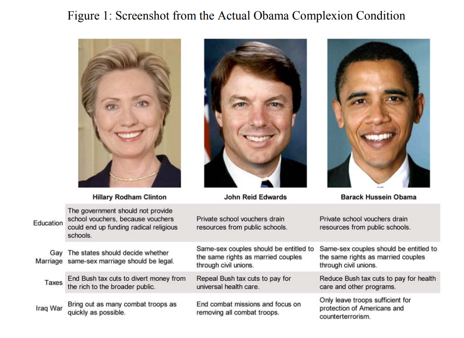{fig-align="center"}

## Tratamientos no textuales^[Iyengar et al. 2010. ``Do Explicit Racial Cues Influence Candidate Preference? The Case of Skin Complexion in the 2008 Campaign.'' Working paper.]


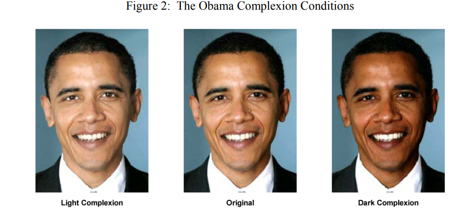{fig-align="center"}


## Manipulación de Audio y Videos

- Problemático por la misma razón que los textos largos
- Mejores prácticas 
	- Que sea breve
	- Hacer que el vídeo se reproduzca automáticamente
	- Deshabilitar la progresión de la encuesta
	- Controlar y validar
- Ejemplos
	- Publicidad de televisión^[Vavreck. 2007 ``The Exaggerated Effects of Advertising on Turnout: The Dangers of Self-Reports.'' Quarterly Journal of Political Science 2: 325--343.]
	- Programas de noticias^[Mutz. 2007. "Effects of `In-Your-Face' Television Discourse on Perceptions of a Legitimate Opposition." American Political Science Review 101(4): 621--635.]

## Diseños de tareas

- Los diseños de tareas piden a los encuestados que realicen una tarea
- Ejemplo más común: escribir algo
- Puede ser problemático:
	- Intensivo en tiempo
	- Invita a abandonar
	- Problemas de cumplimiento 

## Diseños de tareas Ejemplo

Hoy en día, Demócratas y Republicanos difieren considerablemente entre sí. Los dos grupos parecen cada vez más alejados, no sólo en sus opiniones, sino también en sus estilos de vida. Al principio de la encuesta, usted dijo que tiende a identificarse como (demócrata/republicano). Tómese unos minutos para pensar qué le gusta de los (demócratas/republicanos) en comparación con los (republicanos/demócratas). Piense en 2 ó 3 cosas que le gusten especialmente de **su partido**. A continuación, piensa en 2 ó 3 cosas que le disgustan especialmente del **otro partido**. Ahora, por favor, escriba esos pensamientos en el espacio de abajo.

## Diseños de tareas Ejemplo

Hoy en día, Demócratas y Republicanos difieren considerablemente entre sí. Los dos grupos parecen cada vez más alejados, no sólo en sus opiniones, sino también en sus estilos de vida. Al principio de la encuesta, usted dijo que tiende a identificarse como (demócrata/republicano). Tómese unos minutos para pensar qué le gusta de los (demócratas/republicanos) en comparación con los (republicanos/demócratas). Piense en 2 ó 3 cosas que le gusten especialmente de **el otro partido**. A continuación, piensa en 2 ó 3 cosas que le disgustan especialmente de **su partido**. Ahora, por favor, escriba esos pensamientos en el espacio de abajo.

## Experimentos perfiles emparejados o conjoint

- Los experimentos conjoint consisten en medir las preferencias reveladas a partir de una serie de decisiones de elección forzada. 
- Los encuestados deben elegir entre dos "perfiles" distintos que contienen muchas características
- Estimar la importancia relativa de las características de cada atributo (con respecto a una categoría de base)
- Aleatorizar las características de los perfiles le otorga un significado causal a las preferncias entre los atributos 


## Experimentos conjoint

Ventajas

- Imita decisiones del mundo real
- Mayor potencia estadística
- Interpertación causal de las preferencias reveladas

Desventajas

- Mayor complejidad cognitiva para los encuestados que las encuestas tradicionales
- Los resultados de los experimentos conjuntos son difíciles de interpretar
- Crean combinaciones poco realistas

## Ejemplo: Estudio sobre el apoyo a la inmigración^[Hainmueller, Jens, and Daniel J. Hopkins. 2015. “The Hidden American Immigration Consensus: A Conjoint Analysis of Attitudes toward Immigrants.” American Journal of Political Science 59 (3): 529–48]

{width=80%}

## Ejemplo: Estudio sobre el apoyo a la inmigración^[Hainmueller, Jens, and Daniel J. Hopkins. 2015. “The Hidden American Immigration Consensus: A Conjoint Analysis of Attitudes toward Immigrants.” American Journal of Political Science 59 (3): 529–48]

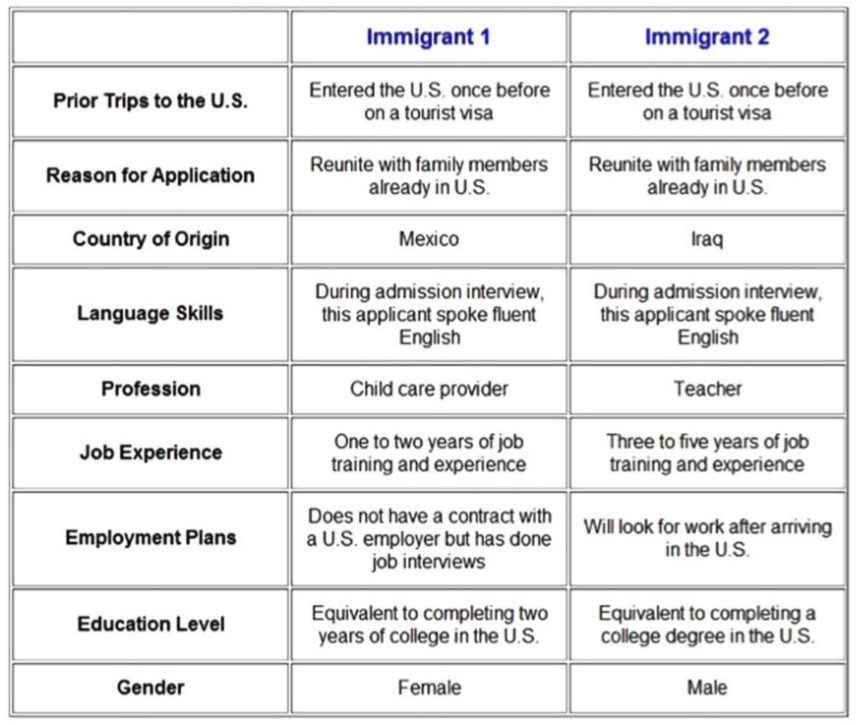{width=80%}

## Ejemplo: Estudio sobre el apoyo a la inmigración^[Hainmueller, Jens, and Daniel J. Hopkins. 2015. “The Hidden American Immigration Consensus: A Conjoint Analysis of Attitudes toward Immigrants.” American Journal of Political Science 59 (3): 529–48]

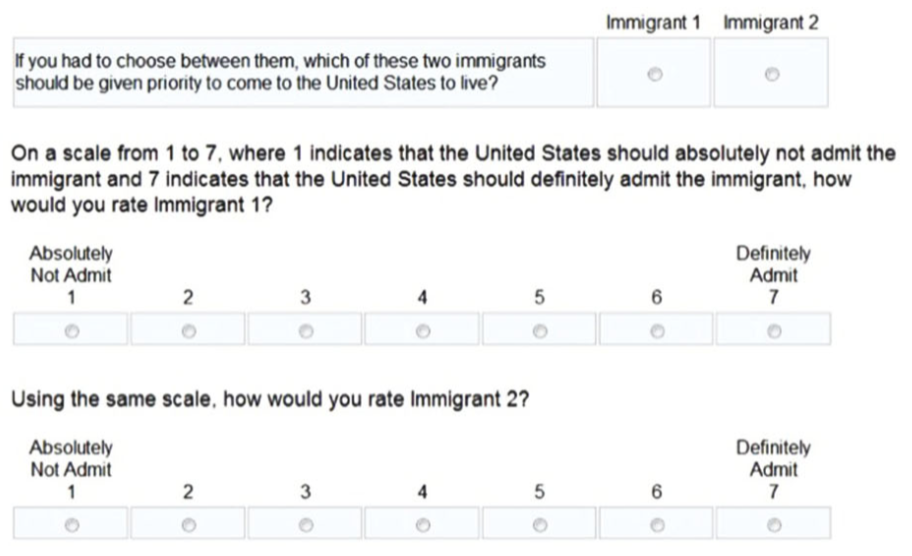{fig-align="center"}

## Ejemplo: Estudio sobre el apoyo a la inmigración^[Hainmueller, Jens, and Daniel J. Hopkins. 2015. “The Hidden American Immigration Consensus: A Conjoint Analysis of Attitudes toward Immigrants.” American Journal of Political Science 59 (3): 529–48]

{width=70%}

## Ejemplo: Estudio sobre el apoyo a la inmigración - Resultados^[Hainmueller, Jens, and Daniel J. Hopkins. 2015. “The Hidden American Immigration Consensus: A Conjoint Analysis of Attitudes toward Immigrants.” American Journal of Political Science 59 (3): 529–48]

{width=60%}

## AMCE (Average Marginal Component Effect)^[Hainmueller, J., Hopkins, D., & Yamamoto, T. (2014). "Causal Inference in Conjoint Analysis: Understanding Multidimensional Choices via Stated Preference Experiments." Political Analysis, 22(1)]

Efecto marginal del atributo l sobre el promedio de la distribución conjunta de los atributos restantes

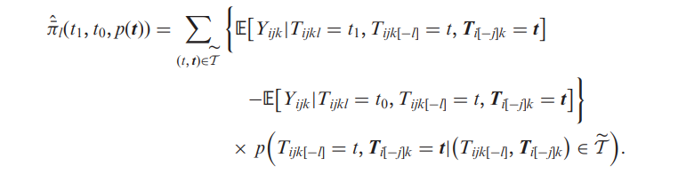{fig-align="center"}


## Manipulation Check

¿Cómo sabemos que estamos manipulando lo que creemos que estamos manipulando?
	
- Una opción: usando manipulation checks
    - Se utilizan para comprobar si la manipulación realizada en un experimento es percibida por los sujetos como el investigador desea que sea percibida

## Manipulation Check^[Kane, J and Barabas, J. 2019. "A Note on Dropping Experimental Subjects Who Fail a Manipulation Check." American Journal of Political Science 36(1): 234--249.]

- Subjective manipulation check
    - Preguntar a los encuestados su opinión sobre la variable independiente manipulada por el investigador
    - No es posible que los individuos den una respuesta errónea
- Instructional Manipulation Checks
    - Técnica que intenta evaluar directamente la atención 
    - No guarda relación con el experimento  
    - No miden la atención en el tratamiento 
- Factual Manipulation Checks
    - Una única pregunta que se formula a todos los participantes en el experimento 
    - Los FMC son MC que aparecen después del tratamiento y son pertinentes para la parte experimental de la encuesta (como los SMC), pero que también tienen opciones de respuesta correcta (como los IMC).

## Manipulation Check^[Kane, J and Barabas, J. 2019. "A Note on Dropping Experimental Subjects Who Fail a Manipulation Check." American Journal of Political Science 36(1): 234--249.]

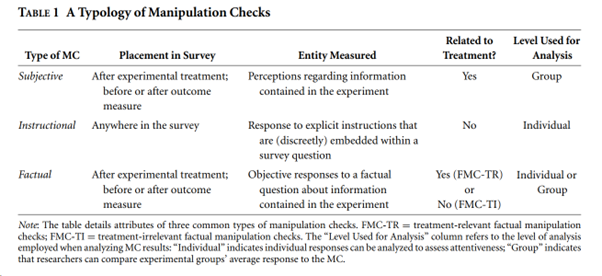{fig-align="center"}

## Subjective Manipulation Check

Al investigar si un servicio militar obligatorio nacional afectaría al apoyo de los estadounidenses a ir a la guerra, Horowitz y Levendusky (2011) intentan manipular las percepciones sobre el restablecimiento del servicio militar obligatorio. 

- El MC de los autores pide a los encuestados que "evalúen la probabilidad de que se reintroduzca el servicio militar obligatorio utilizando una escala de respuesta de orden de 5 puntos que va de 'muy improbable' a 'muy probable'".
    - Las respuestas a este ítem son intrínsecamente subjetiva
    - Si el tratamiento es eficaz, los grupos de tratamiento deberían, en promedio, considerar más probable el restablecimiento del servicios militar obligatorio que el grupo de control.


## Instructional Manipulation Check^[Oppenheimer, D.M. et al. 2009. "Instructional manipulation checks: Detecting satisficing to increase statistical power." Journal of Experimental Social Psychology 45: 867--872.]

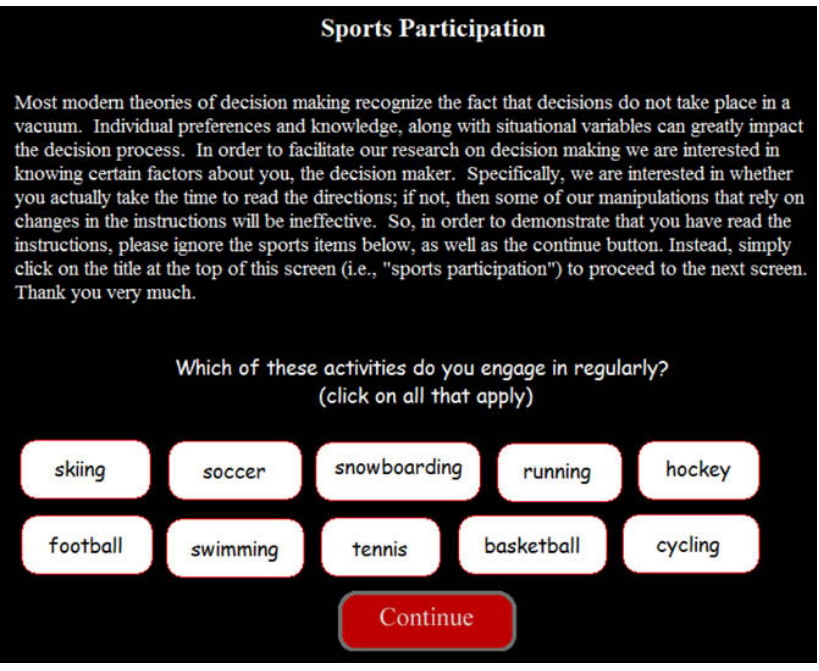{width=80%}

## Instructional Manipulation Check

¿Está de acuerdo o en desacuerdo con la decisión de enviar fuerzas británicas a luchar contra el ISIL en Siria? Nos gustaría saber si estás leyendo las preguntas de esta encuesta. Si está leyendo atentamente, ignore esta pregunta, no seleccione ninguna respuesta y haga clic en "siguiente" para continuar con la encuesta.

- Totalmente en desacuerdo 
- Algo en desacuerdo 
- Ni de acuerdo ni en desacuerdo 
- Algo de acuerdo
- Totalmente de acuerdo


## Factual Manipulation Check^[Turner, J. 2007. “The Messenger Overwhelming the Message: Ideological Cues and Perceptions of Bias in Television News.”Political Behavior 29(4): 441–64.]

Turner (2007) manipula si varias noticias se atribuyen a la CNN o al Fox News Channel, y así pide a todos los encuestados del estudio que indiquen "qué cadena produjo las noticias que vieron". 

## Manipulation Check: Mejores prácticas

- Los controles de manipulación deben ser inocuos:
    - No deben modificar la variable independiente
    - No deben modificar la variable de resultado
- En general, medirlo después del outcome
- Medir tanto lo que se quería manipular como lo que no se quería manipular

## Information Equivalence^[Dafoe, A., Zhang, B., & Caughey, D. (2018). "Information Equivalence in Survey Experiments." Political Analysis, 26(4), 399-416.]

- Los experimentos de encuesta suelen manipular la descripción de atributos en un escenario hipotético, con el objetivo de aprender sobre los efectos de esos atributos en el mundo real
- Estas infrencias se basan en el supuesto de que la manipulación de la encuesta es equivalente en información (IE) con respecto a las características de fondo relevantes del escenario 
-  Generalmente la manipulación de la información sobre un atributo concreto también altera las creencias sobre los atributos de fondo en el escenario
- Decir que un país es "una democracia" podría afecta a las creencias de los sujetos sobre la ubicación geográfica del país. 

## Information Equivalence

\centering
IE ${B_i(Z_i=1)=B_i(Z_i=0)  \forall_i}$

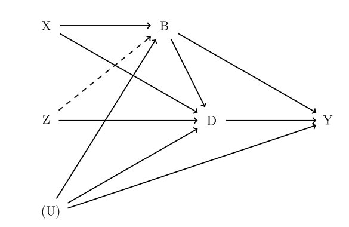{fig-align="center"}

## Posibles soluciones 

1. Estímulo abstracto

2. Control de covariables

3. Incorporar experimentos naturales


## Limitaciones de los experimentos para la identificación causal

- Críticas al contexto experimental
- Críticas a los sujetos participantes de la encuesta (muestra)^[Coppock, Alexander. 2018. "Generalizing from Survey Experiments Conducted on Mechanical Turk: A Replication Approach." Political Science Research and Methods. 1–16]
    

## Ventajas de los experimentos de encuesta

- Son rentables
- Pueden realizarse de forma rápida
- Pueden incluirse en encuestas masivas en línea porque no requieren contacto en persona para su realización	

# Experimentos de Laboratorio

## Lecturas

- Falk & Heckman, 2009: Las Experiments Are a Major Source of Knowledge in the Social Sciences
- Habyarimana, et al., 2007: Why Do Ethnic Diversity Undermine Public Goods Provision?
- Levine & Palfrey, 2007: The Paradox of Voter Participation? A Laboratory Study
- Levitt & List, 2007: What Do Laboratory Experiments Measuring Social Preferences Reveal About the Real World?
- Oxley, et al., 2008: Political Attitudes Vary with Physiological Traits

## Objetivos de los Experimentos

1. Testear teorías
    - Podemos implementar las condiciones de la teoría 
    - Comparar la predicción teórica con el resultado experimental
    - Explorar las causas por las que una teoría falla 

2. Ofrecer modelos comportamentales
    - Estos describen el comportamiento en un contexto particular
    
3. Establecer regularidades empíricas como base de nuevas teorías

4. Testear instituciones y ambientes

5. Evaluar propuestas de políticas

6. Revelación de las preferencias 
    - Valoración 
    - Parámetros de la función de utilidad (tolerancia al riesgo, preferencia temporal, cooperación)

## Experimentos para medir preferencias sociales

{fig-align="center"}

## Experimentos para medir preferencias sociales

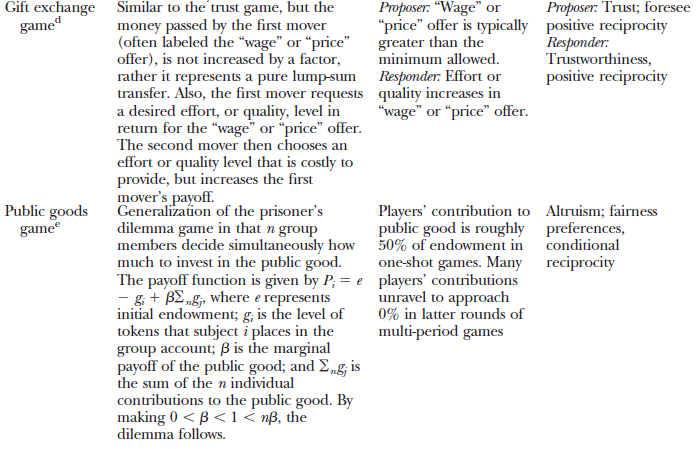{fig-align="center"}


## Ventajas de los experimentos de laboratorio

- Variación controlada:
    - Podemos mantener todo lo demás constante y cambiar de a una variable a la vez
    - Permite un control estricto de los entornos de decisión, de las covariables
    - Esto aplica, en particular, para testear modelos y supuestos comportamentales (teoría de juegos)

- Replicabilidad
    - Suele ser más difícil en los otros tipos de experimentos


## Limitaciones de los experimentos de laboratorio

1. \textit{Los experimentos no son realistas}
    - La simplicidad es una virtud: permite centrarse en los elementos clave

2. \textit{Los experimentos son artificiales}
    - Grupo de sujetos sesgado (estudiantes)
        - Se puede utilizar otros sujetos
    - Número reducido de participantes
        - Se puede aumentar el número de participantes
    - Sujetos inexpertos
        - Se puede reclutar participantes con experiencia
    
3. \textit{Límites de los experimentos}
    - El control nunca es perfecto
        - El tiempo, el entorno del laboratorio condiciona el comportamiento
        - No hay control real sobre los demás motivos 
        
4. Los problemas de siempre (también los tienen otros tipos de experimentos):        
    - Autoselección de los participantes 
    - Validez externa

## ¿Qué hay que diseñar?

-   Pensar sobre los datos necesarios para responder la pregunta
    -   Recolectar todo lo relevante
    -   Obtener información sobre confounders siempre que se pueda
    -   Asegurarse que la cantidad de jugadores sea suficiente para encontrar significancia (a través de simulaciones, por ej.)
    
-   Intentar que las instrucciones sean claras y el juego simple
    -   Se puede realizar un pre-test (piloto)

## ¿Qué hay que diseñar?

Hay que pensar varias cosas a la hora de diseñar un experimento de laboratorio

-   El ambiente:
    -   Agentes (cantidad, tipo -estudiantes o no-, motivación)
    -   Materias primas: ¿Sobre qué se toman las decisiones?
    -   Dotaciones: ¿De qué disponen al iniciar el experimento los tomadores de decisiones?
    -   Mecanismo por el que puede producirse el aprendizaje (oportunidades de búsqueda, práctica)

-   Institución:
    -   Decisiones a disposición de los sujetos
        -   Reglas sobre las decisiones
        -   Reglas sobre la comunicación
    -   Conexión entre decisiones y retribuciones

## ¿Reclutar estudiantes o poblacipon general?

Estudiantes:

-   Normalmente más fáciles de reclutar

-   Se pueden conducir experimentos más difíciles

-   Aprenden más rápido

-   Tienen limitada experiencia de la "vida real", pero no confundirán con "vida real"

-   Evitar estudiantes de misma clase o grupo (salvo que sea el objetivo del estudio)

## ¿Participantes conocidos o extraños?

-   Conocidos:
    -   El grupo está formado por los mismos sujetos
    -   Comportamiento estratégico

-   Extraños:
    -   En cada período se creará un nuevo grupo con nuevos sujetos

-   Extraños perfectos:
    -   Los sujetos nunca se encontrarán con los mismos sujetos en el futuro

## ¿Cuántos?

-   Depende del tipo de experimento

-   Regla general: no menos que los experimentos previos en el área

-   Asegurarse que hay suficientes participantes para cada sesión:
    - Reclutar algunos más de los necesarios
    - Esto es más importante aún cuando los participantes interactúan

- \textbf{Algunas reglas sobre el reclutamiento} 
    -   No promesas falsas
    -   No decirles cuánto dinero ganarán, pero sí decirles que van a ganar algo de dinero incluyendo un pago por presentarse
    -   Decirles que es un experimento que estudia comportamiento humano o toma de decisiones

## ¿Un período o varios períodos?

Un periodo

-   No hay incentivos estratégicos
-   No hay derrames entre períodos
-   Fácil y rápido de conducir

Multi-periodos

-   Hay incentivos estratégicos
-   Efectos dinámicos
    - Por ejemplo: convergencia hacia 0 contribución en juego de bienes públicos
-   Efectos de aprendizaje
-   Más observaciones

## Recompensas

-   Pueden ser en:
    -   Efectivo
    -   Tasa de cambio fijo entre las unidades monetarias experimentales y la moneda local

-   A menos que el tamaño de la apuesta sea la cuestión de la investigación, se debe calibrar con una ganancia media en torno al coste de oportunidad de lo sujetos

-   Si es posible que se produzcan pérdidas en los experimentos, esto debe indicarse claramente, incluyendo cómo cubrir las pérdidas (por ejemplo, con el pago por participación) y si los sujetos pueden dejar de participar en el experimento en caso de sufrir pérdidas

## Condiciones para los incentivos

-   Los sujetos deben preferir obtener más recompensa, y no saciarse

-   La recompensa depende de las acciones del sujeto (sin contar el pago por participación)

-   Los cambios en la utilidad de un sujeto a partir del experimento provienen predominantemente de la recompensa, y la influencia de los otros motivos es insignificante (este supuesto es el más crítico)

-   Si se cumplen estas condiciones, el experimentador controla las preferencias de los sujetos

## A tener en cuenta:

-   Los beneficios para los demás pueden ser importantes para un participante
    - Envidia
    - Equidad
    
-   Deseo de complacer al experimentador
    - Hace que las personas tomen acciones que no tomarían en al vida real

-   Posibles soluciones
    -   Hacer que el cambio en los beneficios monetarios sea lo suficientemente grande
    -   Evitar la información pública sobre los beneficios
    -   No dar pistas sobre el objetivo del experimento
    -   Utilizar un lenguaje neutro en las instrucciones

## Rondas de práctica

-   Sirven para incrementar el entendimiento del experimento

-   Pero puede afectar el comportamiento futuro
    - Las personas pueden inferir a partir del comportamiento en las rondas de práctica

-   Pérdida de información sobre las acciones en el primer período

## Cuestionarios

-   Preguntas socio-económicas

-   Preguntas sobre los motivos del comportamiento en el experimento

-   Preguntas sobre comprensión del experimento

## ¿Experimento en papel o informatizado?

Los experimentos informatizados tienen las siguientes ventajas:

-   Son más simples y rápidos de correr 

-   Menos errores

-   Menos interacción con el experimentalista

-   Los datos se recogen automáticamente

-   Interacción en directo

-   Interfaces dinámicas

Pero:

-   No es visible

-   Lleva tiempo la programación

-   No es posible en todas las circunstancias

## Programas informáticos especializados

-   z-Tree (Fischbacher, 2007)
    -   Zurich Toolbox for Readymade Economic Experiments - http://www.iew.unizh.ch/ztree/index.php
    -   Se ejecuta localmente

-   oTree (Chen, Schonger y Wickens, 2016)
    -   Es un software emergente
    -   Independiente de la plataforma, basado en la web


